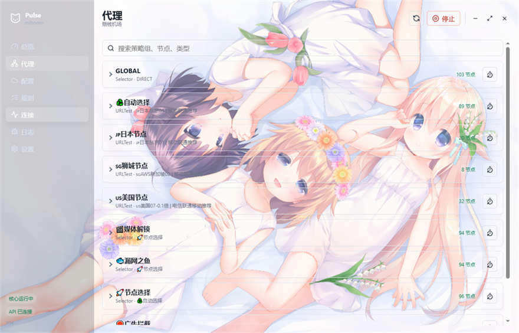
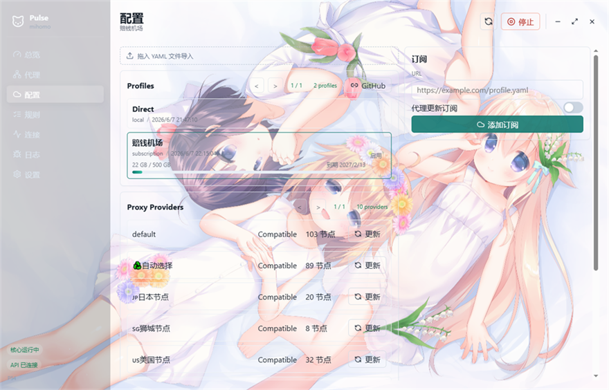

# Pulse

Pulse is a Wails desktop client for the mihomo/Clash.Meta core. The `main` branch is the Wails + React + Go client, while the `c` branch keeps the previous C/Android implementation.

## Preview

### Dashboard

The dashboard shows core status, realtime upload/download speed, total traffic, running time, and current mode in a compact overview.


### Proxies

The proxy page lists Clash selector groups, node counts, current selections, and per-group delay testing.



### Profiles

The profiles page supports subscription import, local YAML drag-and-drop import, subscription usage display, provider updates, and proxy-based subscription updates.



## Features

- Embedded mihomo core mode and custom external core mode.
- Profile management for subscription URLs and local YAML files.
- Proxy group switching, node delay testing, provider updates, rules browsing, and connection management.
- Runtime settings for mixed port, secret, mode, Allow LAN, system proxy, subscription proxy, TUN, and log level.
- Custom background images with adjustable component opacity.
- Tray controls, single-instance handling, and `clash://install-config` URL import on Windows.
- GitHub release update checks and geodata fallback downloads.

## Windows Downloads

Pulse publishes two Windows x64 packages:

- `Pulse-*-windows-app-embedded-amd64.exe.zip`: mihomo is embedded directly in the Pulse app process. This is the simpler portable-style build. The core follows the UI process lifetime, and TUN still depends on the Pulse app process having the required privileges.
- `Pulse-*-windows-service-embedded-amd64.exe.zip`: mihomo is embedded in `PulseStartupService.exe`, which Pulse extracts to the data directory. This build can run the core through `PulseCoreService`, keep the core alive after the UI exits, and is the preferred Windows package for service startup, daemon mode, and TUN usage.

Both packages contain a single Pulse executable archive. Pick only one variant for daily use; the service-embedded package is the main development target on Windows.

## Core

Embedded mode runs mihomo inside Pulse. Custom mode can use an external mihomo binary path.

Pulse writes runtime overrides for:

- `mixed-port`
- `external-controller`
- `secret`
- `mode`
- `allow-lan`
- `tun`
- custom injected rules

## Development

```bash
wails dev
```

```bash
make build-windows
```

Other Makefile targets are available for Linux and macOS workflow builds.
